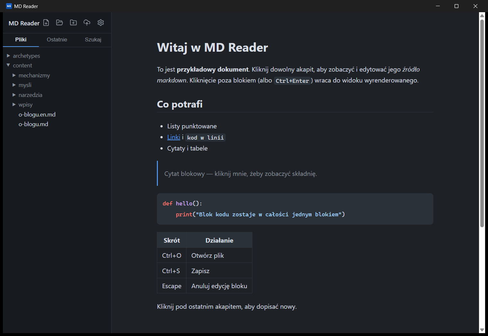

# MD Reader

A lightweight markdown reader & editor for Windows, in the spirit of Typora — free and open source. Built with Tauri 2, so the whole app weighs a few megabytes instead of a few hundred.

> Wersja polska: [mdreader/README.md](mdreader/README.md)



## Why

Typora went paid, Obsidian is a kitchen sink. MD Reader does one thing: you read beautiful rendered markdown, click a paragraph, and it turns into editable source right under your cursor. Click away and it renders back.

## Features

- **Block live-preview editing** — the document is rendered; the block you click shows its raw markdown. `Esc` cancels, `Ctrl+Enter` (or clicking elsewhere) commits.
- **Repository mode** — open a folder and browse its markdown tree in the sidebar (`.git`, `node_modules` and build output are filtered out). Your workspace is remembered across restarts.
- **Recent files** — grouped by folder, one click away.
- **Hugo blog integration** — create a post (`Ctrl+N`) with proper front matter into any `content/<section>/`, toggle `draft` with one click, and publish with a built-in `git add / commit / push` — no terminal needed.
- **Search** — `Ctrl+F` inside the document (highlighted matches, Enter cycles), `Ctrl+Shift+F` across the whole repository.
- **Document-level undo/redo** — `Ctrl+Z` / `Ctrl+Y` works across committed block edits, not just inside one.
- **Local images render** — Hugo-style `/images/…` paths resolve against the repo's `static/`, relative paths against the open file.
- **Open with…** — pass a file as a CLI argument (or associate `.md` with the app) and it opens on start.
- **Syntax highlighting** in fenced code blocks, themed for light and dark mode.
- **Polished by default** — settings panel (language PL/EN, theme, font size), window state persistence, drag & drop to open, unsaved-changes guard.

## Install

Grab the installer (`.exe` or `.msi`) from [Releases](../../releases). Windows SmartScreen may warn about an unknown publisher — the builds are unsigned; click "More info → Run anyway" or build from source below.

## Build from source

Prerequisites: [Node.js](https://nodejs.org) 20+, [Rust](https://rustup.rs), and the MSVC build tools.

```bash
cd mdreader
npm install
npm run tauri dev     # development
npm run tauri build   # installers land in src-tauri/target/release/bundle/
```

## Shortcuts

| Shortcut | Action |
|----------|--------|
| `Ctrl+O` | Open file |
| `Ctrl+N` | New blog post |
| `Ctrl+S` | Save |
| `Ctrl+F` | Find in document |
| `Ctrl+Shift+F` | Search in repository |
| `Ctrl+Z` / `Ctrl+Y` | Undo / redo |
| `Ctrl+Enter` | Commit block edit |
| `Esc` | Cancel block edit / close search |

## Support

If MD Reader saved you a license fee, you can [buy me a coffee](../../sponsors). ☕

## License

[MIT](LICENSE)
