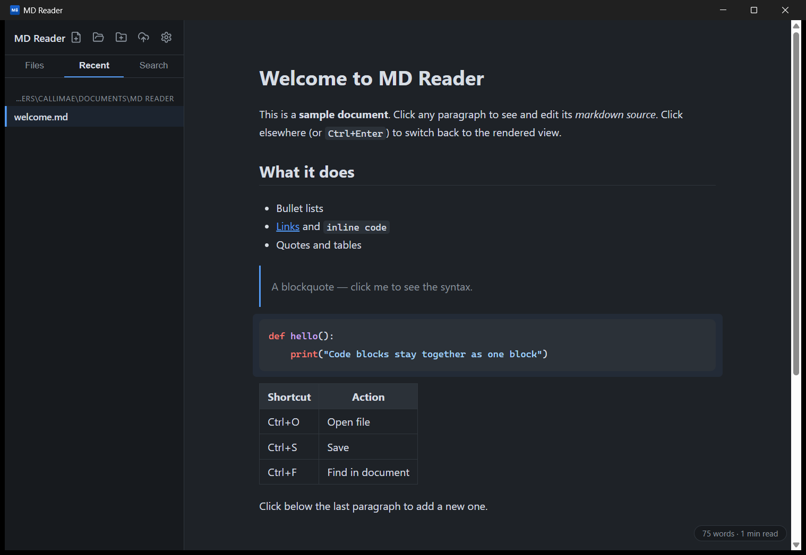
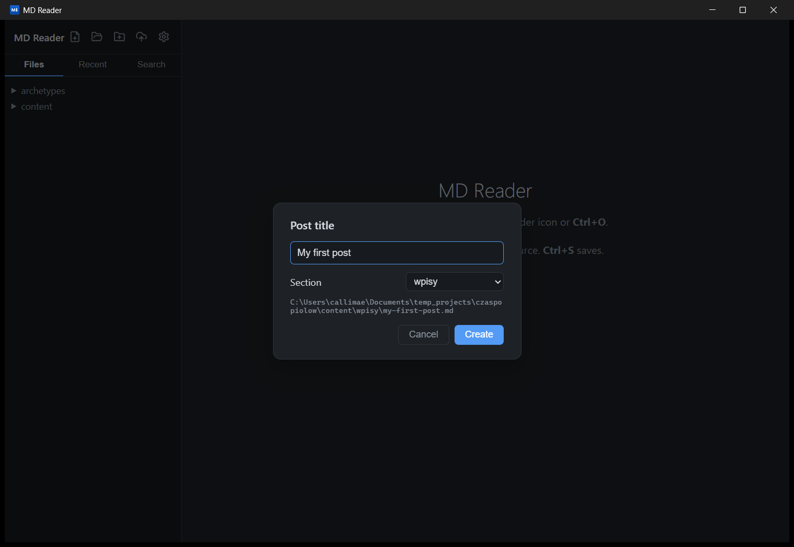

# MD Reader

A lightweight markdown reader & editor for Windows, in the spirit of Typora — free and open source. Built with Tauri 2, so the whole app weighs a few megabytes instead of a few hundred.

> Wersja polska: [mdreader/README.md](mdreader/README.md)



## Why

Typora went paid, Obsidian is a kitchen sink. MD Reader does one thing well: you read beautiful rendered markdown, click a paragraph, and it turns into editable source right under your cursor. Click away and it renders back. And when a post is ready, you publish it to your blog's git repo without leaving the app.



## Features

- **Block live-preview editing** — the document is rendered; the block you click shows its raw markdown. `Esc` cancels, `Ctrl+Enter` (or clicking elsewhere) commits.
- **Repository mode** — open a folder and browse its markdown tree in the sidebar (`.git`, `node_modules` and build output are filtered out). Your workspace is remembered across restarts.
- **Recent files** — grouped by folder, one click away.
- **Publish to a git-based blog** — create a post (`Ctrl+N`) with proper front matter into any `content/<section>/`, toggle `draft` with one click, and publish with a built-in `git add / commit / push` — no terminal needed. Works with any static-site generator whose posts are markdown-with-front-matter in a git repo: **Hugo, Jekyll, Astro, Eleventy, Zola, Gatsby**, and the like.
- **Repository-wide search** — `Ctrl+Shift+F` searches every file in the open folder, with results in the sidebar that jump straight to the matching line.
- **Undo across blocks** — `Ctrl+Z` / `Ctrl+Y` steps through committed block edits, so the block model never costs you your document history.
- **Formatting shortcuts** — `Ctrl+B` / `Ctrl+I` / `Ctrl+K` (bold, italic, link); Enter continues lists and quotes.
- **Local images render** — absolute `/images/…` paths resolve against the repo's `static/` (Hugo layout), relative paths against the open file.
- **Syntax highlighting** in fenced code blocks, themed for light and dark mode.
- **Polished by default** — settings panel (language PL/EN, theme, font size), in-document find (`Ctrl+F`), drag & drop, window-state and unsaved-changes handling, open-with support for `.md` files.

## Install

Grab the installer (`.exe` or `.msi`) from [Releases](../../releases). Windows SmartScreen may warn about an unknown publisher — the builds are unsigned; click "More info → Run anyway" or build from source below.

## Build from source

Prerequisites: [Node.js](https://nodejs.org) 20+, [Rust](https://rustup.rs), and the MSVC build tools.

```bash
cd mdreader
npm install
npm run tauri dev     # development
npm run tauri build   # installers land in src-tauri/target/release/bundle/
```

## Shortcuts

| Shortcut | Action |
|----------|--------|
| `Ctrl+O` | Open file |
| `Ctrl+N` | New blog post |
| `Ctrl+S` | Save |
| `Ctrl+F` | Find in document |
| `Ctrl+Shift+F` | Search in repository |
| `Ctrl+Z` / `Ctrl+Y` | Undo / redo |
| `Ctrl+Enter` | Commit block edit |
| `Esc` | Cancel block edit / close search |

## Support

If MD Reader saved you a license fee, you can [buy me a coffee](../../sponsors). ☕

## License

[MIT](LICENSE)
